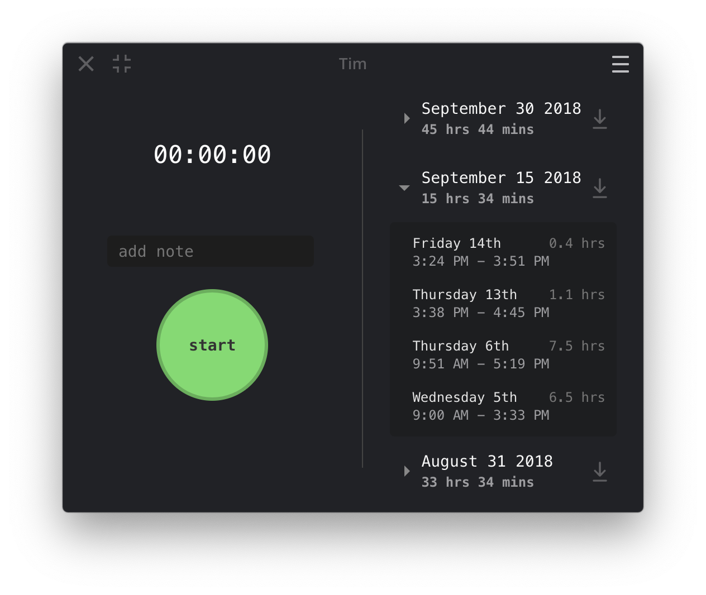
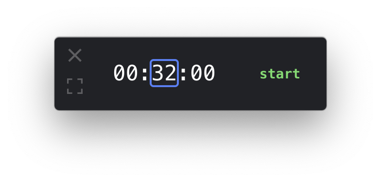

Tim
===
> Desktop application for time tracking and invoice generation.

*Mini Player:*

*Tray Icon:*

#### Features
- track time worked
- keep notes on what was worked on
- export invoice
    - defaults to exporting csv timesheet
    - you can write a custom exporter (find directory at the bottom of the reports sidebar)
- "Mini Player" interface
- OS tray integration

#### Limitations
- only tested on macOS
- hardcoded to 2 week invoice periods: 1st - 15th, 16th - EOM
